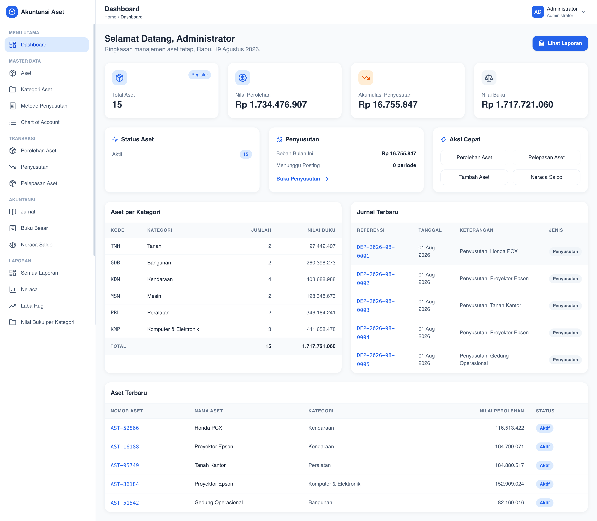

# Akuntansi Manajemen Aset

Aplikasi pembelajaran akuntansi untuk mengelola **aset tetap**, **penyusutan**, dan **pelaporan keuangan** (jurnal, buku besar, neraca saldo, hingga laporan neraca, laba rugi, dan arus kas). Dibangun dengan Laravel 13, Blade, Tailwind CSS, dan SQLite.

## Tampilan



## Fitur

### Master Data
- **Chart of Account (COA)** — daftar akun dengan kategori aset, liabilitas, ekuitas, pendapatan, dan beban.
- **Kategori Aset** — pengelompokan aset yang terhubung dengan akun aset tetap, beban penyusutan, dan akumulasi penyusutan.
- **Metode Penyusutan** — Garis Lurus (SL), Saldo Menurun Ganda (DDB), Jumlah Angka Tahun (SOYD), dan Unit Produksi (UP).
- **Aset** — register aset lengkap (nomor aset, harga perolehan, nilai residu, umur manfaat, lokasi, penanggung jawab, dll).

### Transaksi
- **Perolehan Aset** — pencatatan jurnal perolehan (kas / utang usaha) secara otomatis.
- **Penyusutan** — hitung jadwal penyusutan per periode lalu posting jurnal penyusutan.
- **Pelepasan Aset** — penjualan, penghapusan, atau transfer beserta laba/rugi pelepasan.

### Akuntansi & Pelaporan
- **Jurnal** — daftar seluruh jurnal beserta detail (debit/kredit).
- **Buku Besar** — mutasi dan saldo per akun.
- **Neraca Saldo** — total debit = total kredit dari seluruh jurnal.
- **Laporan** — Neraca, Laba Rugi, Nilai Buku per Kategori, Kartu Aset, Jadwal Penyusutan, Pelepasan Aset, dan Arus Kas.
- **Export PDF** — seluruh laporan dapat diexport ke PDF (Spatie BrowserShot).

### Lainnya
- Dashboard ringkasan (total aset, nilai perolehan, akumulasi penyusutan, nilai buku, status aset, jurnal terbaru).
- Profil pengguna + ganti kata sandi.
- Dokumentasi / panduan pemakaian bawaan aplikasi.

## Teknologi

| Bagian | Teknologi |
| ------ | --------- |
| Backend | Laravel 13, PHP 8.3+ |
| Frontend | Blade, Tailwind CSS (Vite), Lucide Icons, Flatpickr |
| Database | MySQL (produksi) / SQLite (pengembangan) |
| Auth | Session + middleware admin |
| Export PDF | `spatie/browsershot` + Puppeteer + Google Chrome headless |

## Persyaratan

- PHP ^8.3
- Composer
- Node.js 18+ & npm
- Google Chrome / Chromium (untuk export PDF)

## Instalasi

```bash
# 1. Install dependency PHP
composer install

# 2. Siapkan environment
cp .env.example .env
php artisan key:generate

# 3. Atur konfigurasi di .env
APP_NAME="Akuntansi Aset"
APP_URL=http://localhost
DB_CONNECTION=sqlite   # buat file database/database.sqlite jika belum ada
APP_LOCALE=id

# 4. Migrasi + seed data awal (COA, kategori, metode, admin)
php artisan migrate --seed

# 5. Install dependency frontend + build aset
npm install
npm run build
#   (atau npm run dev untuk development)

# 6. Jalankan server
php artisan serve
```

Buka `http://localhost` dan login dengan akun awal:

| Peran | Email | Password |
| ----- | ----- | -------- |
| Administrator | `admin@admin.com` | `password` |

> Segera ganti kata sandi setelah login pertama melalui menu **Profil** di kanan atas.

## Export PDF

Export PDF membutuhkan Node.js, Puppeteer, dan Google Chrome:

```bash
# Install puppeteer (skip download agar memakai Chrome sistem)
PUPPETEER_SKIP_DOWNLOAD=1 npm install -D puppeteer

# Tambahkan konfigurasi di .env bila path Chrome berbeda
# BROWSERSHOT_CHROME_PATH=/Applications/Google Chrome.app/Contents/MacOS/Google Chrome
# BROWSERSHOT_NODE_MODULE_PATH=<absolut path ke node_modules>
```

Saat menjalankan `composer require spatie/browsershot`, pastikan `config/services.php` memuat blok `browsershot` dengan `chrome_path` dan `node_module_path`.

## Testing

```bash
php artisan test
```

Suite mencakup: master data, alur transaksi (perolehan/penyusutan/pelepasan), akuntansi (jurnal, buku besar, neraca saldo, laporan), autentikasi (login/logout/profil), dan verifikasi export PDF.

## Struktur Proyek

```text
app/
 ├── Http/Controllers/      # Controller aplikasi
 ├── Models/                # Eloquent models (Asset, Journal, Account, dll.)
 ├── Services/
 │    ├── AcquisitionService.php
 │    ├── DepreciationService.php
 │    ├── DisposalService.php
 │    ├── JournalService.php
 │    ├── FinancialReportService.php
 │    ├── ReportDataService.php
 │    └── PdfExportService.php
 ├── Http/Middleware/       # EnsureUserIsAdmin
resources/views/
 ├── layouts/               # app, print, header, sidebar
 ├── assets, asset-categories, depreciation-methods, accounts
 ├── acquisitions, depreciations, disposals
 ├── journals, ledger, trial-balance
 ├── reports/               # tampilan laporan + reports/print (PDF)
 ├── auth, profile, dashboard, documentation
 └── components/            # x-forms.*, x-table.*, x-flash
database/seeders/           # COA, kategori, metode penyusutan, akun admin
docs/PRD.md                 # Dokumen spesifikasi & panduan pemakaian
```

## Lisensi

Proyek ini dibangun untuk keperluan pembelajaran akuntansi dan dilisensikan di bawah [MIT license](https://opensource.org/licenses/MIT).